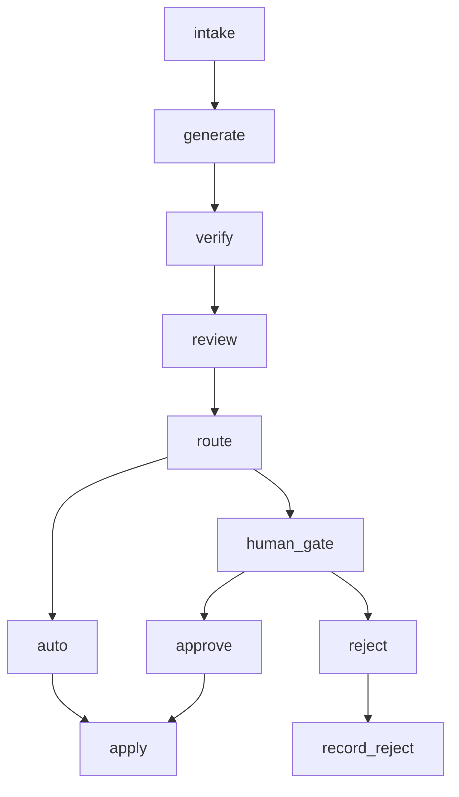

# 과제 보고서 — agent-release-gate

## 1. 문제 정의

에이전트 산출물을 전부 사람이 보면 병목이 되고, 전부 자동으로 반영하면 위험하다.
그래서 "어디서 멈출지"를 규칙으로 정한다.
이 POC는 코드 패치마다 멈춤 신호를 계산하고, 신호가 하나라도 있으면
사람 승인 전에는 저장소에 반영하지 않는 게이트를 만든다.

## 2. 구조도



- `intake` — 케이스 적재 (`request`·`diff`·`test_passed`)
- `generate` — diff 파싱 (`files`·`lines_changed`)
- `verify` — 테스트 결과 기록
- `review` — 신호 계산 (`signals`·`rationale`·`risk_score`·`stop_reasons`)
- `route` — 별도 노드가 아니라 `review` 뒤의 조건 분기.
  `stop_reasons`가 비었으면 `apply`, 있으면 `human_gate`
- `auto` — 자동 적용 경로 (`route`에서 바로 `apply`)
- `human_gate` — `interrupt`로 대기. 부수효과 없이 값만 올린다
- `approve` — 승인 재개 시 `apply`로 이동
- `apply` — sandbox에 커밋 1개 생성
- `reject` — 반려 재개 시 `record_reject`로 이동
- `record_reject` — 반영 없이 `rejected` 기록

## 3. 멈춤 기준과 이유

| 신호 | 계산식 | 막는 위험 |
|---|---|---|
| `size` | `lines_changed > 70` 또는 `files > 2` | 사람이 한 번에 읽기 어려운 큰 변경이 그대로 들어가는 위험 |
| `protected_path` | 경로가 `.github/**`·`package.json`·`pyproject.toml`·파일명 `auth` 포함·`.env` 포함 중 하나에 해당 | CI·의존성·인증·비밀 설정이 바뀌는 위험 |
| `secret` | 추가된 줄(`+`, `+++` 제외)에 `sk-…`·`ghp_…`·`AKIA…`·`PRIVATE KEY` 패턴 중 하나가 매칭 | 비밀키가 저장소에 커밋되는 위험 |
| `test_failed` | `test_passed === false` | 깨진 변경이 그대로 들어가는 위험 |

위험 점수는 신호 가중치(`size` 25, `protected_path` 40, `secret` 50,
`test_failed` 30)의 합을 0~100으로 자른 값이다.

fail-closed 원칙을 쓴다. 신호 계산 중 예외가 나면 `risk_score` 100,
`stop_reasons`에 `review_error`를 넣어 멈춤 쪽으로 보낸다
(`src/gate/graph.ts`의 `review` 노드).

자동 적용 경로로 간 건이 감당 가능한 이유는 되돌리기가 커밋 1개 revert로 끝나기 때문이다.
`apply` 노드는 패치 적용 후 커밋을 1개만 만든다
(`sandbox main에 커밋 1개가 추가됩니다 …, 되돌리기: git revert <sha>`).

## 4. 임계값 근거

`pnpm threshold`를 별도 clone에서 실행한 실제 출력:

```
repos: 21, commits scanned: 350, skipped (no counted files): 50
lines: p25=5 p50=70 p75=352 p90=1117 (n=300)
files: p25=1 p50=2 p75=6 p90=14 (n=300)
```

이 명령은 `~/Desktop/aiffel/*` 아래 git 저장소들의 커밋별 변경 줄·파일 수 분포를 센다
(lock 파일·`dist/`·`*.ipynb` 제외).

70줄·2파일을 상한으로 쓴 이유는 줄 수 분포의 p50(70)과
파일 수 분포의 p50(2)을 가져온 것이다.
절반의 커밋은 자동으로 지나가고 나머지 절반은 사람이 본다는 위치에 선을 그은 셈이다.

## 5. 실행 결과

`pnpm batch`를 별도 clone에서 실행한 실제 출력 원문:

```
case_id | expected | actual | stop_reasons | risk | final_status | commit_sha | match
case-01 | auto | auto | [] | 0 | auto_applied | 4e786d6 | O
case-02 | auto | auto | [] | 0 | auto_applied | bbe388d | O
case-03 | auto | auto | [] | 0 | auto_applied | d94f4a3 | O
case-04 | auto | auto | [] | 0 | auto_applied | 096b5a0 | O
case-05 | auto | auto | [] | 0 | auto_applied | 5140290 | O
case-06 | stop:[size] | stop | [size] | 25 | (pending) | - | O
case-07 | stop:[size] | stop | [size] | 25 | (pending) | - | O
case-08 | stop:[protected_path] | stop | [protected_path] | 40 | (pending) | - | O
case-09 | stop:[protected_path] | stop | [protected_path] | 40 | (pending) | - | O
case-10 | stop:[secret] | stop | [secret] | 50 | (pending) | - | O
case-11 | stop:[test_failed] | stop | [test_failed] | 30 | (pending) | - | O
case-12 | stop:[test_failed] | stop | [test_failed] | 30 | (pending) | - | O
case-13 | stop:[size,test_failed] | stop | [size,test_failed] | 55 | (pending) | - | O
case-14 | stop:[protected_path,secret] | stop | [protected_path,secret] | 90 | (pending) | - | O
auto 5 / stop 9 / mismatch 0
sandbox commits: 6
```

자동 5건, 멈춤 9건이다. `mismatch 0`은 14건 전부의 실제 경로·멈춤 사유가
fixture의 `expected`와 일치한다는 뜻이다.
`sandbox commits` 6은 초기 커밋 1개 + 자동 적용 5개를 더한 수다.

## 6. 사람 개입 설계

멈춘 건에 대해 사람이 보는 정보는 다음과 같다.

- 멈춘 이유 (`stop_reasons`, 신호별 근거 문장 `rationale`)
- 승인 시 효과 (`effect_on_approve`: 바뀌는 파일·증감 줄 수·되돌리기 방법)
- 원본 diff와 검증 로그 (`test_passed`)

`interrupt` + SqliteSaver를 쓴다.
멈춘 건의 상태는 `data/gate.sqlite`에 남으므로
프로세스를 재시작한 뒤에도 대기가 유지되고,
`resume` 명령(또는 서버 승인 API)으로 같은 `thread_id`(`case_id`)에서 이어간다.

게이트 노드(`human_gate`)는 부수효과가 없다.
`interrupt` 값만 올리고, 재개되면 노드를 처음부터 다시 실행한다.
커밋을 만드는 쪽은 `apply` 노드 한 곳뿐이다.

## 7. 화면 설계

`.roster/api-contract.md`와 `.roster/spec-2.md` 기준이며, 서버 통합 전이라 실제 화면은 미확인이다.
(서버 통합 후 확인)

- 목록: 대기 건의 `case_id`·요청 요약·멈춤 사유 배지
  (`size`·`protected_path`·`secret`·`test_failed` 각각 다른 색 + 텍스트 라벨)·위험 점수
- 상단: 통계(자동/대기/승인/반려/커밋 수), "전체 실행" 버튼
- 상세: 요청 원문, diff(추가 줄 초록·삭제 줄 빨강, 고정폭),
  검증 로그, 판단 근거, 멈춘 이유, 승인 시 효과 문장,
  반려 사유 입력칸, 승인·반려 버튼
- 이력: 처리된 건의 최종 상태와 `commit_sha`

<!-- screenshot -->

## 8. 한계와 확장

- 생성·리뷰가 fixture·규칙 기반이다.
  패치는 미리 정해진 14건에서 읽고, 판단은 네 신호 계산뿐이다.
  실제 모델이 만드는 패치나 사람이 쓰는 리뷰 코멘트는 이 POC에 없다.
- `FixtureSource`를 `GitBranchSource`로, `SandboxApplier`를 실제 저장소 merge로
  교체하는 경계(`sources.ts`·`appliers.ts`)까지만 정해져 있고 교체 자체는 미구현이다.
- 반려 후 재생성 루프가 없다. `reject`는 기록으로 끝나고,
  반려 사유를 반영해 패치를 다시 만드는 흐름은 이어지지 않는다.

## 9. 회고

- 문서에 들어간 수치는 전부 별도 clone에서 명령을 돌려 가져왔고,
  작업 디렉토리의 `data/`·`sandbox/`에는 손대지 않았다.
- 서버·화면 절은 계약 문서 기준으로만 쓰고 미확인 표시를 남겼다.
  실물 확인은 서버 통합 뒤에 해야 한다.
- 임계값 근거는 분포 출력 그대로 옮겼고, 70줄·2파일이 p50이라는 연결만 적었다.
  분포 모집단이 `~/Desktop/aiffel/*`라는 점은 §4에 적는 데 그쳤다.
