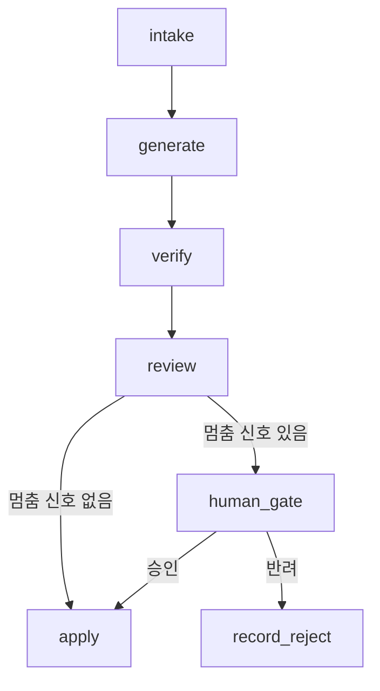
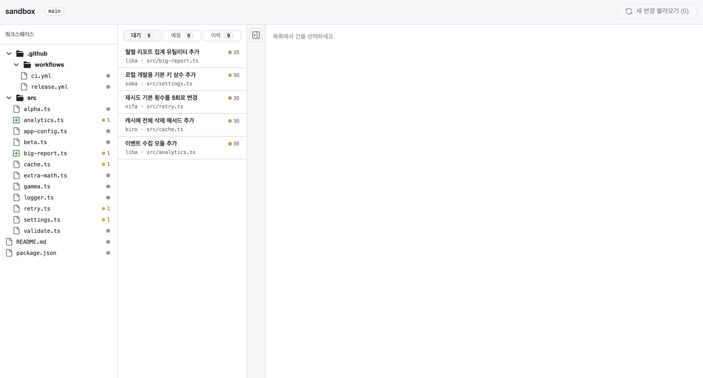
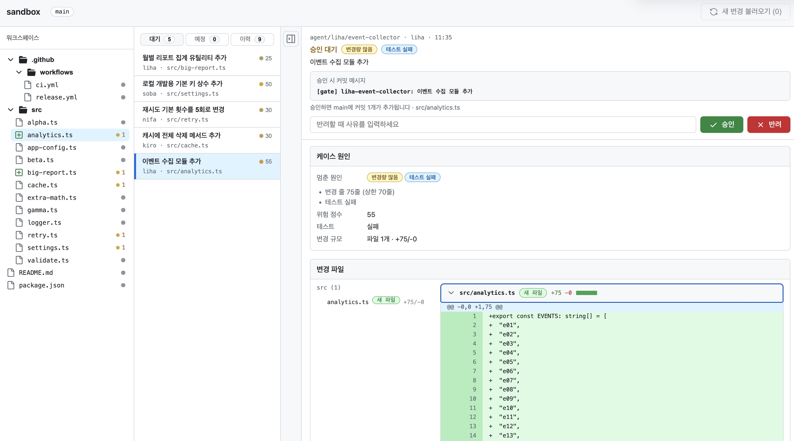
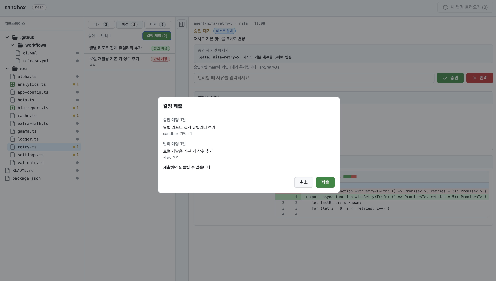

# 과제 보고서 — agent-release-gate

## 1. 문제

에이전트가 만든 변경을 사람이 전부 검토하면 사람이 병목이 된다. 전부 자동으로 반영하면 키가 새거나 CI가 깨진 채로 main에 들어간다.
이 프로젝트는 변경마다 멈춤 신호를 계산하고, 신호가 하나라도 있으면 사람이 승인하기 전까지 main에 반영하지 않는다.
신호가 없는 변경만 자동으로 커밋한다.

## 2. 구조



| 노드 | 하는 일 |
|---|---|
| `intake` | 변경 하나를 읽는다 (`request`, `diff`, `test_passed`) |
| `generate` | diff에서 바뀐 파일과 줄 수를 센다 |
| `verify` | 테스트 결과를 기록한다 |
| `review` | 멈춤 신호, 근거 문장, 위험 점수를 계산하고 다음 노드를 고른다 |
| `human_gate` | `interrupt`로 멈추고 사람의 답을 기다린다. 판단 값만 올리고 저장소는 건드리지 않는다 |
| `apply` | sandbox main에 커밋 1개를 만든다 |
| `record_reject` | 반영하지 않고 반려 사유를 기록한다 |

## 3. 멈춤 기준

| 신호 | 계산 | 막는 위험 |
|---|---|---|
| 변경량 많음 (`size`) | 변경 줄 > 70 또는 파일 > 2 | 한 번에 읽기 어려운 변경이 검토 없이 들어간다 |
| 핵심 설정 파일 (`protected_path`) | `.github/**`, `package.json`, `pyproject.toml`, 이름에 `auth`나 `.env`가 들어간 파일 | CI, 의존성, 인증 설정이 바뀐다 |
| 키 노출 의심 (`secret`) | 추가된 줄에 `sk-…`, `ghp_…`, `AKIA…`, `PRIVATE KEY` 패턴 | 키가 main 이력에 영구히 남는다 |
| 테스트 실패 (`test_failed`) | `test_passed`가 false | 깨진 코드가 들어간다 |

위험 점수는 신호 가중치(변경량 많음 25, 핵심 설정 파일 40, 키 노출 의심 50, 테스트 실패 30)를 더하고 100에서 자른 값이다. 사람이 무엇부터 볼지 정하는 데만 쓰고, 멈출지 말지는 신호 유무로만 정한다.

신호 계산 중 예외가 나면 위험 점수 100, 멈춤 사유 `review_error`로 사람에게 넘긴다. 판단이 불확실하면 멈추는 쪽을 택했다.

신호가 없는 변경을 자동으로 커밋해도 되는 이유는 되돌리기가 쉬워서다. `apply`는 변경 하나에 커밋을 정확히 1개 만들기 때문에, 문제가 생기면 그 커밋 하나만 revert하면 된다.

## 4. 임계값 근거

70줄과 2파일은 직감으로 정하지 않고, 내 과거 커밋 분포에서 가져왔다. `~/Desktop/aiffel/*` 아래 git 저장소의 커밋별 변경 줄과 파일 수를 셌다(lock 파일, `dist/`, `*.ipynb` 제외).

```
repos: 21, commits scanned: 350, skipped (no counted files): 50
lines: p25=5 p50=70 p75=352 p90=1117 (n=300)
files: p25=1 p50=2 p75=6 p90=14 (n=300)
```

두 값 모두 중앙값(p50)이다. 평소 커밋의 절반은 자동으로 지나가고, 나머지 절반은 사람이 보는 위치다.

## 5. 실행 결과

`pnpm batch`를 깨끗한 clone에서 실행한 출력이다.

```
case_id | agent | expected | actual | stop_reasons | risk | final_status | commit_sha | match
liha-log-timestamp | liha | auto | auto | [] | 0 | auto_applied | 518c392 | O
mara-math-helper | mara | auto | auto | [] | 0 | auto_applied | d14a417 | O
dena-timeout-10s | dena | auto | auto | [] | 0 | auto_applied | f4bfa02 | O
soba-readme-lint | soba | auto | auto | [] | 0 | auto_applied | 7477a0a | O
nifa-validate-message | nifa | auto | auto | [] | 0 | auto_applied | 57e7f1e | O
liha-monthly-report | liha | stop:[size] | stop | [size] | 25 | (pending) | - | O
mara-greek-constants | mara | stop:[size] | stop | [size] | 25 | (pending) | - | O
dena-ci-test-step | dena | stop:[protected_path] | stop | [protected_path] | 40 | (pending) | - | O
kiro-package-lint | kiro | stop:[protected_path] | stop | [protected_path] | 40 | (pending) | - | O
soba-dev-default-key | soba | stop:[secret] | stop | [secret] | 50 | (pending) | - | O
nifa-retry-5 | nifa | stop:[test_failed] | stop | [test_failed] | 30 | (pending) | - | O
kiro-cache-clear | kiro | stop:[test_failed] | stop | [test_failed] | 30 | (pending) | - | O
liha-event-collector | liha | stop:[size,test_failed] | stop | [size,test_failed] | 55 | (pending) | - | O
mara-release-workflow | mara | stop:[protected_path,secret] | stop | [protected_path,secret] | 90 | (pending) | - | O
auto 5 / stop 9 / mismatch 0
sandbox commits: 6
```

14건 중 5건이 자동으로 커밋되고 9건이 멈췄다. `mismatch 0`은 14건 모두 예상한 경로와 멈춤 사유로 갔다는 뜻이다. 커밋 6개는 초기 커밋 1개와 자동 커밋 5개다.

멈춘 9건 중 2건을 사람이 처리했다.

- 승인: `pnpm batch resume liha-monthly-report approve "월간 보고서 승인"` → `approved_applied`, 커밋 6 → 7
- 반려: `pnpm batch resume soba-dev-default-key reject "개발용 키도 저장소에 넣지 않는다"` → `rejected`, 커밋 7 그대로

나머지 7건은 대기 상태로 남겼다. 커밋 해시는 clone마다 다르다.

## 6. 사람 개입 설계

멈춘 건을 열면 사람은 다음을 본다.

- 요청 원문과 에이전트, 브랜치, 올라온 시각
- 멈춘 원인과 근거 문장 (예: "변경 줄 80줄 (상한 70줄)")
- 승인하면 일어나는 일: "승인하면 main에 커밋 1개가 추가됩니다 · src/big-report.ts"와 남을 커밋 메시지
- 파일별 diff와 테스트 결과

멈춘 상태는 SQLite 체크포인터(`data/gate.sqlite`)에 저장된다. 서버를 껐다 켜도 대기 건이 그대로 남고, 화면이나 `resume` 명령으로 같은 `thread_id`(= `case_id`)에서 이어서 실행한다.

`interrupt`는 재개할 때 그 노드를 처음부터 다시 실행한다. 그래서 `human_gate`에는 부수효과를 두지 않았다. 커밋은 `apply` 한 곳에서만 만들어지므로, 재개가 여러 번 일어나도 커밋이 중복되지 않는다.

## 7. 화면 설계







화면은 GitHub의 저장소·PR 화면 구성을 따랐다. 개발자에게 이미 익숙한 배치라서다.

- 왼쪽: 워크스페이스 파일 트리. 대기 건이 걸린 파일에는 주황 점과 건수, 새로 생길 파일에는 초록 `+`가 붙는다. 파일을 누르면 그 파일의 대기 건(없으면 가장 최근 이력)이 열린다
- 가운데: `대기 · 예정 · 이력` 탭과 목록. 목록 한 줄에는 제목, 에이전트, 대표 파일, 위험 점수만 둔다
- 오른쪽: 상단에 고정된 결정 바(요청, 멈춤 원인, 커밋 메시지, 승인 효과, 승인·반려), 그 아래 케이스 원인과 변경 파일

승인과 반려는 누르는 즉시 반영하지 않는다. 먼저 "예정"으로 표시하고, 예정 탭에서 "결정 제출"을 눌러 확인창을 거친 뒤 한꺼번에 반영한다. 제출 전에는 표시를 바꾸거나 취소할 수 있다. 제출 후에는 되돌릴 수 없다는 점을 확인창에 적었다.

만들었다가 뺀 것도 있다.

| 뺀 것 | 이유 |
|---|---|
| 모두 펼치기/접기 | 파일마다 접을 수 있어 중복이고, 아이콘으로 바꾸자 뜻이 더 흐려졌다 |
| 승인 효과 장문과 되돌리기 안내 | 커밋 메시지, 제출 확인창과 내용이 겹쳤다. 한 줄로 줄였다 |
| 헤더의 카운터 7개 | 탭 숫자와 겹치고, 전체 커밋 수에 초기 커밋이 섞여 헷갈렸다 |
| 목록의 원인 라벨 | 한 줄에 정보가 너무 많았다. 위험 점수와 색 점만 남기고 원인은 마우스를 올리면 보이게 했다 |
| 트리의 파일별 커밋 메시지 | 트리가 복잡해졌다. 파일을 눌렀을 때 상세에만 보인다 |
| 영문 상태값과 `case-01` 같은 순번 | 사람이 읽는 라벨과 에이전트·작업 이름으로 바꿨다 |

화면 동작은 jsdom으로 실제 DOM을 띄워 점검했다. 목록 수, 예정 탭 이동, 제출 후 커밋 수, 라벨, 아이콘이 Octicons 원본과 같은지 등 30개 항목에서 실패는 0건이다. 트리 행 높이처럼 레이아웃 계산이 필요한 항목은 jsdom에서 확인할 수 없어, 실제 브라우저에서 눈으로 확인했다.

## 8. 한계와 확장

- 에이전트의 변경은 미리 만든 예시 14건이고, 판단은 신호 4개 계산뿐이다. 실제 에이전트 브랜치를 읽는 `GitBranchSource`와 실제 저장소로 merge하는 적용기는 경계(`sources.ts`, `appliers.ts`)만 정해 두었다.
- 테스트 결과는 예시 데이터에 적힌 값을 쓴다. 실제로 쓰려면 브랜치마다 테스트를 돌리는 단계가 필요하다.
- 반려한 뒤 사유를 반영해 변경을 다시 만드는 흐름은 없다.
- LLM은 쓰지 않았다. 과제 안내에 모델 호출 요구가 없고, 멈춤 판단은 같은 입력에 항상 같은 결과가 나와야 설명할 수 있기 때문이다. 붙인다면 판단은 규칙에 두고, 사람에게 보여 줄 근거 문장만 모델이 쓰게 하는 것이 맞다고 본다.

## 9. 회고

가장 공들인 부분은 멈춤과 반영을 분리한 것이다. `human_gate`는 판단 값만 올리고 커밋은 `apply` 한 곳에서만 만들도록 해서, 서버를 재시작하거나 재개가 반복되어도 커밋이 한 번만 생긴다. 이 동작은 깨끗한 clone에서 서버를 껐다 켜며 승인·반려·중복 승인(409)까지 확인했다.

승인 화면은 직접 써 보면서 여러 번 고쳤다. 처음 요구사항을 화면 요소 목록으로만 적었더니, 무엇이 먼저 보여야 하는지와 문구가 정해지지 않아 배치·라벨·중복 표시를 계속 손봐야 했다. 즉시 반영하던 승인 버튼을 "표시 후 제출"로 바꾼 것도 써 보고 나서야 드러난 문제였다.

화면 점검에도 시행착오가 있었다. 처음 만든 점검 스크립트는 DOM을 흉내 낸 객체 위에서 돌아서, 실제 브라우저에서는 동작하지 않던 "모두 펼치기"를 통과로 보고했다. 이후 jsdom 기반 점검으로 바꾸고, 결함이 있는 이전 버전에서 실제로 실패하는지 먼저 확인한 뒤 사용했다.

보완하고 싶은 점은 세 가지다.

- 실제 에이전트 브랜치와 테스트 실행을 붙여 예시 데이터를 걷어 낸다
- 임계값이 중앙값이라 평소 변경의 절반이 멈춘다. 실제로 써 보며 멈춤 비율을 보고 다시 정한다
- 트리 행 높이 같은 레이아웃 점검을 실제 브라우저로 자동화한다
