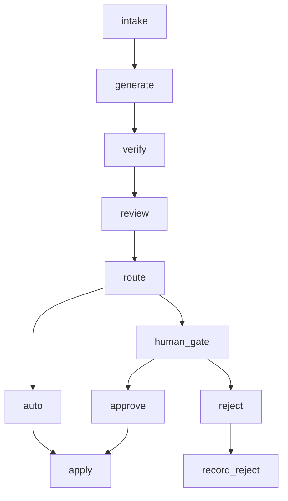

# 과제 보고서 — agent-release-gate

## 1. 문제 정의

에이전트 산출물을 전부 사람이 보면 병목이 되고, 전부 자동으로 반영하면 위험하다.
그래서 "어디서 멈출지"를 규칙으로 정한다.
이 POC는 코드 패치마다 멈춤 신호를 계산하고, 신호가 하나라도 있으면
사람 승인 전에는 저장소에 반영하지 않는 게이트를 만든다.

## 2. 구조도



- `intake` — 케이스 적재 (`request`·`diff`·`test_passed`)
- `generate` — diff 파싱 (`files`·`lines_changed`)
- `verify` — 테스트 결과 기록
- `review` — 신호 계산 (`signals`·`rationale`·`risk_score`·`stop_reasons`)
- `route` — 별도 노드가 아니라 `review` 뒤의 조건 분기.
  `stop_reasons`가 비었으면 `apply`, 있으면 `human_gate`
- `auto` — 자동 적용 경로 (`route`에서 바로 `apply`)
- `human_gate` — `interrupt`로 대기. 부수효과 없이 값만 올린다
- `approve` — 승인 재개 시 `apply`로 이동
- `apply` — sandbox에 커밋 1개 생성
- `reject` — 반려 재개 시 `record_reject`로 이동
- `record_reject` — 반영 없이 `rejected` 기록

## 3. 멈춤 기준과 이유

| 신호 | 계산식 | 막는 위험 |
|---|---|---|
| 변경량 많음 (`size`) | `lines_changed > 70` 또는 `files > 2` | 사람이 한 번에 읽기 어려운 큰 변경이 그대로 들어가는 위험 |
| 핵심 설정 파일 (`protected_path`) | 경로가 `.github/**`·`package.json`·`pyproject.toml`·파일명 `auth` 포함·`.env` 포함 중 하나에 해당 | CI·의존성·인증·비밀 설정이 바뀌는 위험 |
| 키 노출 의심 (`secret`) | 추가된 줄(`+`, `+++` 제외)에 `sk-…`·`ghp_…`·`AKIA…`·`PRIVATE KEY` 패턴 중 하나가 매칭 | 비밀키가 저장소에 커밋되는 위험 |
| 테스트 실패 (`test_failed`) | `test_passed === false` | 깨진 변경이 그대로 들어가는 위험 |

위험 점수는 신호 가중치(변경량 많음 25, 핵심 설정 파일 40, 키 노출 의심 50,
테스트 실패 30)의 합을 0~100으로 자른 값이다.

fail-closed 원칙을 쓴다. 신호 계산 중 예외가 나면 `risk_score` 100,
`stop_reasons`에 `review_error`를 넣어 멈춤 쪽으로 보낸다
(`src/gate/graph.ts`의 `review` 노드).

자동 승인 경로로 간 건이 감당 가능한 이유는 되돌리기가 커밋 1개 revert로 끝나기 때문이다.
`apply` 노드는 패치 적용 후 커밋을 1개만 만든다
(`sandbox main에 커밋 1개가 추가됩니다 …, 되돌리기: git revert <sha>`).

## 4. 임계값 근거

`pnpm threshold`를 별도 clone에서 실행한 실제 출력:

```
repos: 21, commits scanned: 350, skipped (no counted files): 50
lines: p25=5 p50=70 p75=352 p90=1117 (n=300)
files: p25=1 p50=2 p75=6 p90=14 (n=300)
```

이 명령은 `~/Desktop/aiffel/*` 아래 git 저장소들의 커밋별 변경 줄·파일 수 분포를 센다
(lock 파일·`dist/`·`*.ipynb` 제외).

70줄·2파일을 상한으로 쓴 이유는 줄 수 분포의 p50(70)과
파일 수 분포의 p50(2)을 가져온 것이다.
절반의 커밋은 자동으로 지나가고 나머지 절반은 사람이 본다는 위치에 선을 그은 셈이다.

## 5. 실행 결과

`pnpm batch`를 별도 clone에서 실행한 실제 출력 원문:

```
case_id | agent | expected | actual | stop_reasons | risk | final_status | commit_sha | match
liha-log-timestamp | liha | auto | auto | [] | 0 | auto_applied | 518c392 | O
mara-math-helper | mara | auto | auto | [] | 0 | auto_applied | d14a417 | O
dena-timeout-10s | dena | auto | auto | [] | 0 | auto_applied | f4bfa02 | O
soba-readme-lint | soba | auto | auto | [] | 0 | auto_applied | 7477a0a | O
nifa-validate-message | nifa | auto | auto | [] | 0 | auto_applied | 57e7f1e | O
liha-monthly-report | liha | stop:[size] | stop | [size] | 25 | (pending) | - | O
mara-greek-constants | mara | stop:[size] | stop | [size] | 25 | (pending) | - | O
dena-ci-test-step | dena | stop:[protected_path] | stop | [protected_path] | 40 | (pending) | - | O
kiro-package-lint | kiro | stop:[protected_path] | stop | [protected_path] | 40 | (pending) | - | O
soba-dev-default-key | soba | stop:[secret] | stop | [secret] | 50 | (pending) | - | O
nifa-retry-5 | nifa | stop:[test_failed] | stop | [test_failed] | 30 | (pending) | - | O
kiro-cache-clear | kiro | stop:[test_failed] | stop | [test_failed] | 30 | (pending) | - | O
liha-event-collector | liha | stop:[size,test_failed] | stop | [size,test_failed] | 55 | (pending) | - | O
mara-release-workflow | mara | stop:[protected_path,secret] | stop | [protected_path,secret] | 90 | (pending) | - | O
auto 5 / stop 9 / mismatch 0
sandbox commits: 6
```

자동 5건, 멈춤 9건이다. `mismatch 0`은 14건 전부의 실제 경로·멈춤 사유가
fixture의 `expected`와 일치한다는 뜻이다.
`sandbox commits` 6은 초기 커밋 1개 + 자동 적용 5개를 더한 수다.

멈춤 9건의 사람 처리는 위 배치 직후 같은 clone에서 2건 수행했다
(eb1f312 clone, 2026-09-28 실행 원문):

- 승인 1건: `pnpm batch resume liha-monthly-report approve "월간 보고서 승인"` →
  `{"final_status": "approved_applied", "commit_sha": "63f98f8a58716a4ea2626b4cf7d6856799c270a1"}`.
  `sandbox` 커밋 수 6 → 7.
- 반려 1건: `pnpm batch resume soba-dev-default-key reject "개발용 키도 저장소에 넣지 않는다"` →
  `{"final_status": "rejected", "commit_sha": ""}`.
  `sandbox` 커밋 수 7 유지.

`commit_sha`는 clone마다 달라진다. 나머지 멈춤 7건은 대기 상태로 두었다.

## 6. 사람 개입 설계

멈춘 건에 대해 사람이 보는 정보는 다음과 같다.

- 멈춘 이유 (`stop_reasons`, 신호별 근거 문장 `rationale`)
- 승인 시 효과 (`effect_on_approve`: 바뀌는 파일·증감 줄 수·되돌리기 방법)
- 원본 diff와 검증 로그 (`test_passed`)

`interrupt` + SqliteSaver를 쓴다.
멈춘 건의 상태는 `data/gate.sqlite`에 남으므로
프로세스를 재시작한 뒤에도 대기가 유지되고,
`resume` 명령(또는 서버 승인 API)으로 같은 `thread_id`(`case_id`)에서 이어간다.

게이트 노드(`human_gate`)는 부수효과가 없다.
`interrupt` 값만 올리고, 재개되면 노드를 처음부터 다시 실행한다.
커밋을 만드는 쪽은 `apply` 노드 한 곳뿐이다.

## 7. 화면 설계

아래 (a)는 eb1f312 `src/ui.html` 코드 읽기 기준이다.
실기동 화면 캡처는 (c)에 적힌 대로 캡틴 촬영 예정이다.

보여 주기로 한 것:

- 3열: 작업대 트리(LNB, `data-role="workspace-tree"`) · 케이스 목록(탭 `대기 N`·`예정 N`·`이력 N`) · 상세
- 헤더: `sandbox` 제목 + `새 변경 불러오기 (N)`(N = 미실행 수, 0이면 비활성). 그 외 카운터 없음
- 상세: 결정 바(`data-role="decision-bar"`: 요청 1문장·상태·원인 배지·마지막 커밋 1줄·승인 시 커밋 메시지·승인 효과 한 줄·반려 사유 입력·승인/반려 버튼)
  → 케이스 원인 박스(`data-role="summary"`: 멈춘 원인·위험 점수·테스트·변경 규모·근거 문장 목록)
  → 변경 파일 박스(파일별 접기/펼치기, git 메타 헤더 미표시)
  → 제출 확인 모달(`결정 제출`, 건별 결과 표시)
- 예정 탭: 승인 예정/반려 예정 칩 + 반려 사유 한 줄, 상단에 `승인 N · 반려 N` + 결정 제출 버튼.
  표시된 건은 대기 탭에서 빠지고, 해제하면 대기 탭으로 복귀한다
- 이력 탭 상단 한 줄: `자동 승인 N · 승인 반영 N · 반려 N · 반영 커밋 N`(초기 커밋 제외)

뺀 것과 이유(`.roster/captain-findings.md` 원장 기준):

| 뺀 것 | 이유 |
|---|---|
| 모두 펼치기/접기 버튼 | 캡틴 삭제 요청(14:07). 스텁 점검이 ok로 보고했으나 실브라우저에서 동작하지 않음(13:43) |
| 승인 효과 장문·되돌리기 안내 | 결정 바에는 `승인하면 main에 커밋 1개가 추가됩니다 …` 한 줄만 둠(14:18, eb1f312) |
| 헤더 카운터 7개 | `sandbox` + 새 변경 불러오기로 축소(14:49, spec-11) |
| 목록 원인 라벨 | 위험 점수 숫자 + 점만 두고 원인 라벨은 `title`로(14:43, spec-10) |
| 트리 파일별 커밋 메시지 줄 | 트리에서 제거, 파일 클릭 시 마지막 커밋 1줄은 결정 바에만(14:26) |
| 영문 원시값(`size` 등)·case 순번 | 라벨만 표시하고 ID는 `<agent>-<slug>` 합성(rev5) |

실행 증거(외부 QA 하네스): 하네스 자체는 저장소 밖 QA 소유라 원문은 `.roster/verify-result-4.md`에 있다.
대상 ecfece9 기준 29 ok / 0 FAIL, `p` 1건 SKIP(jsdom에 레이아웃이 없어 실브라우저 행 높이 미측정).
eb1f312의 추가분(결정 바 승인 효과 한 줄)은 하네스 실행 범위에 없어 실기동 화면과 함께 미확인이다.

화면 캡처 자리:


위 3장은 캡틴 촬영 예정이다. 이미지 파일은 저장소에 넣지 않았다.

## 8. 한계와 확장

- 생성·리뷰가 fixture·규칙 기반이다.
  패치는 미리 정해진 14건에서 읽고, 판단은 네 신호 계산뿐이다.
  실제 모델이 만드는 패치나 사람이 쓰는 리뷰 코멘트는 이 POC에 없다.
- `FixtureSource`를 `GitBranchSource`로, `SandboxApplier`를 실제 저장소 merge로
  교체하는 경계(`sources.ts`·`appliers.ts`)까지만 정해져 있고 교체 자체는 미구현이다.
- 반려 후 재생성 루프가 없다. `reject`는 기록으로 끝나고,
  반려 사유를 반영해 패치를 다시 만드는 흐름은 이어지지 않는다.

LLM 미사용 이유: 과제 사양 70줄에 모델 호출 요구 문장이 없다
(`.roster/assignment-compliance.md` §6).
멈춤 판단은 네 신호 계산(순수 함수)으로 고정되어 있어 같은 입력에 같은 출력이 나온다.
확장 경로는 판단 근거 문장만 생성하는 노드와 `GitBranchSource` 교체 지점
(`sources.ts`·`appliers.ts`)으로 남겨 두었다.

## 9. 회고

- 문서에 들어간 수치는 전부 별도 clone에서 명령을 돌려 가져왔고,
  작업 디렉토리의 `data/`·`sandbox/`에는 손대지 않았다.
- 서버·화면 절은 계약 문서 기준으로만 쓰고 미확인 표시를 남겼다.
  실물 확인은 서버 통합 뒤에 해야 한다.
- 임계값 근거는 분포 출력 그대로 옮겼고, 70줄·2파일이 p50이라는 연결만 적었다.
  분포 모집단이 `~/Desktop/aiffel/*`라는 점은 §4에 적는 데 그쳤다.
- 캡틴 지적 원장(`.roster/captain-findings.md`) 24행 중 19행의 근인에
  PM 스펙 단계의 미규정·누락(화면 배치·동선, 카운터, 라벨, 탭)이 적혀 있다.
- `scripts/ui-smoke.mjs`는 구현자가 만든 스텁 DOM 점검이고,
  모두 펼치기/접기를 ok로 보고했으나 실브라우저에서 동작하지 않았다.
  이후 QA 소유의 jsdom 하네스(저장소 밖)로 교체되었다.
